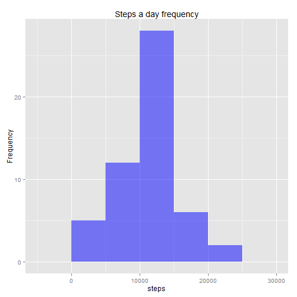
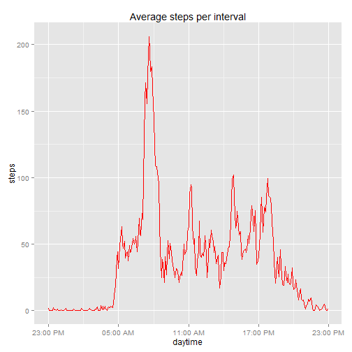
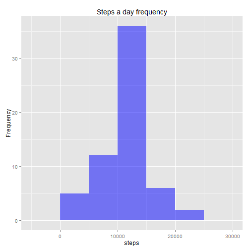
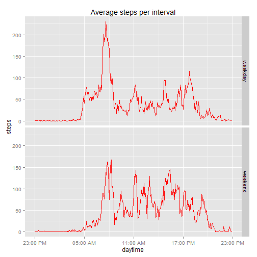

# Loading and preprocessing the data

## Load the data

If not done so already, the data can be downloaded from the following URL, https://d396qusza40orc.cloudfront.net/repdata%2Fdata%2Fdata.zip.

Now we read in the data using the ```{r} read.csv``` command.


```r
data <- read.csv("C:/Users/admin/Desktop/activity.csv")
```

## Process/transform the data (if necessary) into a format suitable for your analysis

In order to make our data set more readable, we will convert all of our times to the POSIXct format and then convert the intervals into times in the day. We can do this using the ```transform``` function. We then conduct some basic exploratory analyses using the various summary functions:


```r
data <- transform(data, 
     datetime = strptime( paste(date,formatC(interval,width=4,flag="0")), "%Y-%m-%d %H%M"),
     daytime = strptime( paste("1970-01-01",formatC(interval,width=4,flag="0")), "%Y-%m-%d %H%M"))
str(data)
```

```
## 'data.frame':	17568 obs. of  5 variables:
##  $ steps   : int  NA NA NA NA NA NA NA NA NA NA ...
##  $ date    : Factor w/ 61 levels "2012-10-01","2012-10-02",..: 1 1 1 1 1 1 1 1 1 1 ...
##  $ interval: int  0 5 10 15 20 25 30 35 40 45 ...
##  $ datetime: POSIXct, format: "2012-10-01 00:00:00" "2012-10-01 00:05:00" ...
##  $ daytime : POSIXct, format: "1970-01-01 00:00:00" "1970-01-01 00:05:00" ...
```


```r
summary(data)
```

```
##      steps                date          interval     
##  Min.   :  0.00   2012-10-01:  288   Min.   :   0.0  
##  1st Qu.:  0.00   2012-10-02:  288   1st Qu.: 588.8  
##  Median :  0.00   2012-10-03:  288   Median :1177.5  
##  Mean   : 37.38   2012-10-04:  288   Mean   :1177.5  
##  3rd Qu.: 12.00   2012-10-05:  288   3rd Qu.:1766.2  
##  Max.   :806.00   2012-10-06:  288   Max.   :2355.0  
##  NA's   :2304     (Other)   :15840                   
##     datetime                      daytime                   
##  Min.   :2012-10-01 00:00:00   Min.   :1970-01-01 00:00:00  
##  1st Qu.:2012-10-16 05:58:45   1st Qu.:1970-01-01 05:58:45  
##  Median :2012-10-31 11:57:30   Median :1970-01-01 11:57:30  
##  Mean   :2012-10-31 11:30:52   Mean   :1970-01-01 11:57:30  
##  3rd Qu.:2012-11-15 17:56:15   3rd Qu.:1970-01-01 17:56:15  
##  Max.   :2012-11-30 23:55:00   Max.   :1970-01-01 23:55:00  
## 
```


```r
head(data)
```

```
##   steps       date interval            datetime             daytime
## 1    NA 2012-10-01        0 2012-10-01 00:00:00 1970-01-01 00:00:00
## 2    NA 2012-10-01        5 2012-10-01 00:05:00 1970-01-01 00:05:00
## 3    NA 2012-10-01       10 2012-10-01 00:10:00 1970-01-01 00:10:00
## 4    NA 2012-10-01       15 2012-10-01 00:15:00 1970-01-01 00:15:00
## 5    NA 2012-10-01       20 2012-10-01 00:20:00 1970-01-01 00:20:00
## 6    NA 2012-10-01       25 2012-10-01 00:25:00 1970-01-01 00:25:00
```

# What is mean total number of steps taken per day?

## If you do not understand the difference between a histogram and a barplot, research the difference between them. Make a histogram of the total number of steps taken each day

In order to sketch a histogram, we will use the ```ggplot2``` package and the following code:


```r
library(ggplot2)
plot <- function( x ) {
    stepsaday <- aggregate( steps ~ date, data=x, FUN=sum)
    p <- ggplot(stepsaday, aes(steps))
    p <- p + geom_histogram(binwidth=5000,fill="blue",alpha=0.5)
    p <- p + labs(y="Frequency",title="Steps a day frequency")
    print(p)

    stepsaday 
}
stepsaday <- plot( data )
```

 

## Calculate the total number of steps taken per day

The total number of steps can be calculated using:


```r
sum(stepsaday$steps)
```

```
## [1] 570608
```

## Calculate and report the mean and median of the total number of steps taken per day

The mean number of steps can be calculated using:


```r
mean(stepsaday$steps)
```

```
## [1] 10766.19
```

and the median by: 


```r
median(stepsaday$steps)
```

```
## [1] 10765
```

# What is the average daily data pattern?

## Make a time series plot (i.e. type = "l") of the 5-minute interval (x-axis) and the average number of steps taken, averaged across all days (y-axis)

Again, we can use the ```ggplot2``` package to make a times series which plots the steps at a given time of day.


```r
library(ggplot2)
library(scales)
plotavg <- function( x ) {
    avgsteps <- aggregate( steps ~ daytime , data=x, FUN=mean)
    p <- ggplot(avgsteps,aes(daytime,steps))
    p <- p + geom_line(color="red")
    p <- p + scale_x_datetime(labels=date_format("%H:%M %p"))
    p <- p + labs(title="Average steps per interval")
    print(p)    
    avgsteps    
}
avgsteps <- plotavg( data )
```

 

## Which 5-minute interval, on average across all the days in the dataset, contains the maximum number of steps?

From the above time series, we can see that the maximum should occur somewhere between 8-9am. Indeed:


```r
avgsteps[which.max(avgsteps$steps),]
```

```
##                 daytime    steps
## 104 1970-01-01 08:35:00 206.1698
```

# Inputting missing values

##Calculate and report the total number of missing values in the dataset (i.e. the total number of rows with NAs)

To calculate this, we can make use of the ```is.na``` function:


```r
sum(is.na(data$steps))
```

```
## [1] 2304
```

## Devise a strategy for filling in all of the missing values in the dataset. The strategy does not need to be sophisticated. For example, you could use the mean/median for that day, or the mean for that 5-minute interval, etc.

In order to fill in all of the missing values, we could note that the mean value of steps taken throughout the day varies quite a bit as the day progresses. Hence it would suffice to fill all of the missing values with the mean number of steps for that interval.

## Create a new dataset that is equal to the original dataset but with the missing data filled in.

For this section, I have chosen to use the ```dplyr``` package which was introduced during the Getting and Cleaning Data course of the Data Science Specialisation:


```r
library(dplyr)
completedata <- inner_join(data,avgsteps,by="daytime")
missingvals <- is.na(completedata$steps.x)
completedata$steps.x[missingvals] <- completedata$steps.y[missingvals]
completedata <- transform(completedata,
                             steps = steps.x,
                             steps.x=NULL,
                             steps.y=NULL)
```

## Make a histogram of the total number of steps taken each day and Calculate and report the mean and median total number of steps taken per day. Do these values differ from the estimates from the first part of the assignment? What is the impact of imputing missing data on the estimates of the total daily number of steps?

Using the above code, our histogram is:


```r
completeplot <- plot( completedata )
```

 

and the new mean and median can be foud using:


```r
mean(completeplot$steps)
```

```
## [1] 10766.19
```

and


```r
median(completeplot$steps)
```

```
## [1] 10766.19
```

# Are there differences in data patterns between weekdays and weekends?

## Create a new factor variable in the dataset with two levels - "weekday" and "weekend" indicating whether a given date is a weekday or weekend day.


```r
weekenddata <- with(completedata, 
                ifelse( weekdays(datetime) %in% c("Saturday","Sunday"),"weekend","weekday"))
completedata$weekenddata <- factor(weekenddata)
steps.bywknd <- aggregate( steps ~ weekenddata + daytime, data=completedata,FUN = mean)
```

## Make a panel plot containing a time series plot (i.e. type = "l") of the 5-minute interval (x-axis) and the average number of steps taken, averaged across all weekday days or weekend days (y-axis). See the README file in the GitHub repository to see an example of what this plot should look like using simulated data.

Using the following code, we can compare the number of steps taken on weekends and weekdays:


```r
library(ggplot2)
library(scales)
p <- ggplot(steps.bywknd,aes(x=daytime,y=steps))
p <- p +geom_line( col= "red")+facet_grid(weekenddata~.)
p <- p + scale_x_datetime(labels=date_format("%H:%M %p"))
p <- p + labs(title="Average steps per interval")
p
```

 

The most notable differences between the two graphs are the larger spike around 9am on weekdays and the higher variability of steps taken during weekdays. 

One possible explanation for the smaller 9am spike at weekends could be that there is fewer people working and more people choosing to lie in. The variability could also be explained from a work point of view - just before 9am there is a lot of rushing around getting ready for work and going to work, however, once 9am hits most people arrive and spend most of the rest of the day sitting down at their desks. The weekend is less variable because people have more freedom to go out and do more leisurely activities during the daylight hours.
